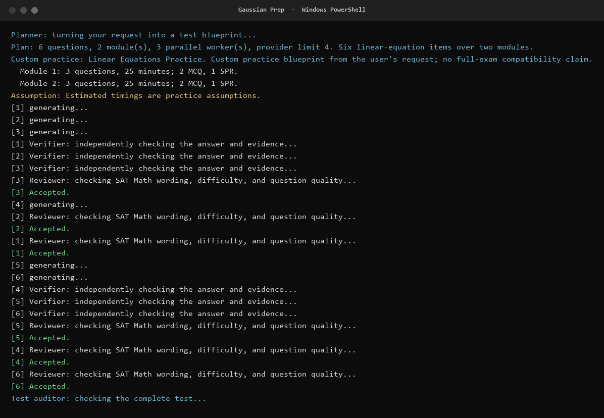
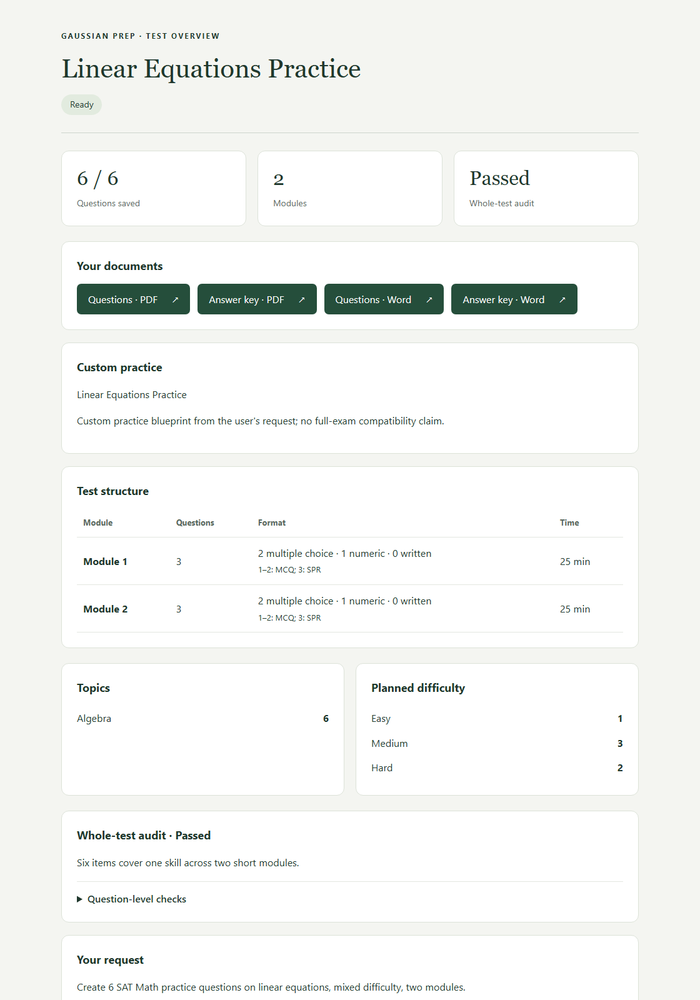
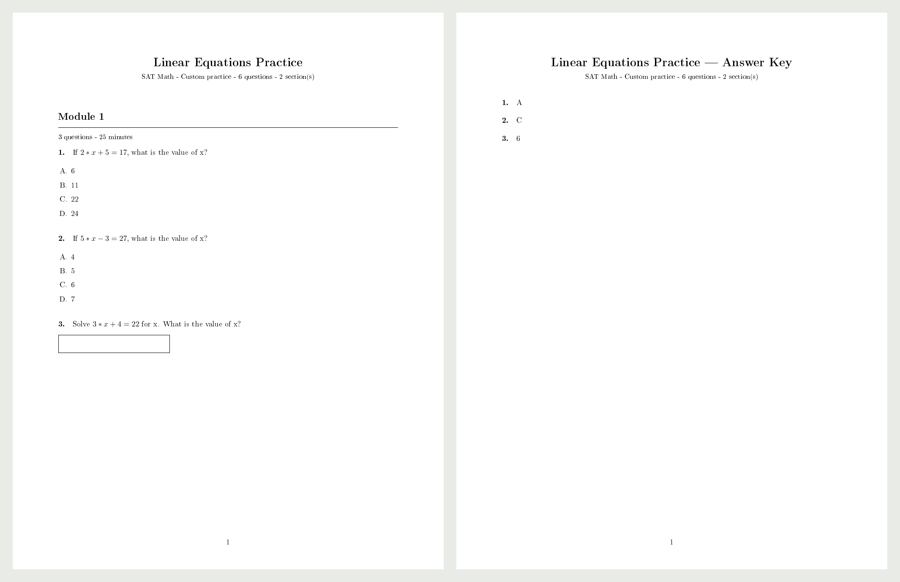

<p align="center">
  
</p>

# Gaussian Prep

Gaussian Prep builds exam practice from a question dataset and a plain-language request. It plans the paper, generates or adapts questions, checks answers, reviews individual items, and audits the completed set. It exports a question sheet and separate answer key as PDF or DOCX, with an offline HTML summary.

The planner, generator, verifier, reviewer, and auditor use separate calls to the same model. Supported mathematical answers are checked with SymPy; other tasks rely on model reasoning and review. These checks do not guarantee correct answers, official exam alignment, originality, or calibrated difficulty. Review the material before using it with students.



## Requirements and setup

- Python 3.11 or newer.
- A question dataset in JSON, JSONL, or CSV. PDF and image-only question banks are not imported.
- Access to a configured model provider, or a local Ollama server with a suitable model.
- Tcl/Tk if you want the dataset file chooser. Supplying a dataset path avoids the chooser.

The launch scripts use Windows and PowerShell. You can also start the Python program directly, but this release has not been validated on macOS or Linux.

From the project folder, create the environment and install the project:

```powershell
.\setup.ps1 -PythonPath C:\path\to\python.exe
```

Then double-click `START.cmd` or run:

```powershell
.\run.ps1
```

For an existing Python environment, install with `python -m pip install .` and run `python -m gaussian_prep`. Keep `PROMPTS.md` in the working directory if you want its editable examples and planner guidance; it is optional.

A LaTeX engine is optional. PDF export tries `pdflatex`, `xelatex`, `lualatex`, then Tectonic. If compilation fails or no engine is available, it uses the built-in PDF renderer and retains the LaTeX source. DOCX does not require LaTeX. Font coverage and layout vary between renderers.

## Basic usage

The interactive flow selects a dataset, asks for the exam and subject, takes your request, and asks for a provider, model ID, and API key. Use `SAT Math` or `SAT Verbal` explicitly for SAT material.

```powershell
.\run.ps1 generate "Generate 4 questions on linear equations: 3 MCQ and 1 open-ended." --dataset data\questions.json --prep-material "SAT Math"
```

Inspect a dataset without credentials or model calls:

```powershell
.\run.ps1 inspect data\questions.json --report dataset-report.json
```

The loader accepts a JSON array, a JSON object containing `questions` or `records`, JSONL records, or CSV rows. Typical fields are `question_id`, `domain`, `subskill`, `difficulty`, `format`, `question`, `choices`, and `answer`. Passages, structured tables, and geometric figures are supported. The [reference](docs/reference.md#datasets) lists aliases and validation rules. No dataset is bundled; use material you are entitled to process and share.

SAT Math and recognized quantitative subjects generate new questions using the dataset as a reference. SAT Verbal, reading, language, history, and unrecognized subjects adapt source questions, preserving the passage, stem, table, and figure. All source records remain in the dataset; quality flags are advisory.

Use **practice** for a custom count and topic selection, up to 100 questions. Use **mock** for a complete exam, section, or named paper with a defined structure. A dataset may supply `exam_structure` metadata. Structure conflicts block completion. See [PROMPTS.md](PROMPTS.md) for request examples.

## Configuration

One provider, model, and key serve all five roles. OpenCode Go is the default; the [provider table](docs/reference.md#providers-and-models) lists the built-in endpoints and environment prefixes.

Set `<PREFIX>_MODEL` and `<PREFIX>_API_KEY` to avoid credential prompts, and pass `--provider`, `--prep-material`, a request, and `--format` for an unattended run. Model IDs must contain only letters, digits, periods, underscores, or hyphens. Available models and account quotas are not checked against a provider catalog.

The custom provider reads `CUSTOM_BASE_URL`; use a trusted HTTPS endpoint for remote services. Ollama uses `http://localhost:11434/v1` and needs no API key. Dataset selection can also come from `GAUSSIAN_DATASET`, with `SATPREP_DATASET` retained for compatibility. The app does not load `.env` files automatically.

The default budget is 400 model calls per invocation. An uncomplicated run needs roughly `3 × question count + 2` calls; retries and revisions add more. `--max-calls` changes the budget, `--revisions` controls item revisions, and `--audit-revisions` controls audit replacement rounds. Concurrency settings are local heuristics, not guarantees about a provider's current limits.

## Saved runs and recovery

Runs are saved under `runs/<timestamp>/` unless you supply `--out`:

```text
summary.html
questions.pdf / questions.docx
answer-key.pdf / answer-key.docx
support/
  state.json
  diagnostics/
  sources/
  rendering/
  recovery/
```

Only selected export formats are written. Keep `support/` with the run so it can be resumed or exported again. To continue:

```powershell
.\run.ps1 resume runs\20260101-120000-000000
```

Resume requires the original dataset contents, checked by hash. If the dataset moved, the app asks you to locate it. Local recovery rechecks saved work and backs up changed checkpoints before continuing. Accepted questions are reused; unfinished items or audits may need more model calls. Ctrl+C stops the run and keeps checkpointed work.

A completed run can retain whole-test audit warnings after its replacement budget is exhausted. Completion means the per-item checks passed and the audit ran, not that every audit concern was resolved.





## Privacy and security

Selected dataset examples, requests, and generated content are sent to the chosen provider. Its data policies apply. Diagnostic files save request payloads and provider responses; checkpoints also contain the dataset's absolute path. Run summaries repeat your request. Treat the entire run folder as private until you have reviewed it for sharing.

The app omits authentication headers from its logs and does not deliberately save the configured API key. That does not make logs anonymous or safe to publish: provider responses and user content may contain sensitive information. Keep keys out of datasets, prompts, screenshots, and committed files. Store private datasets under the ignored `data/` folder and keep runs under the ignored `runs/` folder.

Mathematical expressions use a restricted parser and a computation subprocess with a timeout. Native TeX inputs are filtered and conventional compilers receive `-no-shell-escape`. These controls are not an operating-system sandbox. Use trusted local installations of Python and LaTeX, and do not resume checkpoints from untrusted sources.

## Development

```powershell
.\.venv\Scripts\python.exe -m pip install -e ".[dev]"
.\.venv\Scripts\python.exe -m pytest -q
.\.venv\Scripts\python.exe -m pip check
.\.venv\Scripts\python.exe -m pip wheel . --no-deps --wheel-dir dist
```

Tests cover mathematical checks, scripted provider responses, generation and recovery, rendering security, PDF/DOCX exports, and command-line behavior. A native compilation test skips when no LaTeX engine is available. Tests make no paid model calls. There is no configured formatter, linter, type checker, or vulnerability-database audit command.

Application code lives in `src/gaussian_prep/`, tests in `tests/`, and detailed documentation in `docs/`. The [reference](docs/reference.md) describes the role schemas, structure checks, rendering rules, command-line options, and limitations.
